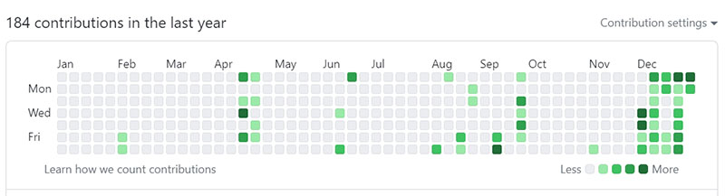
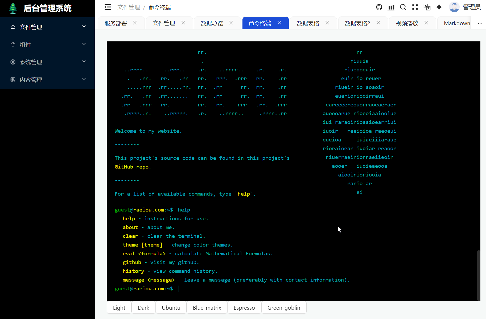
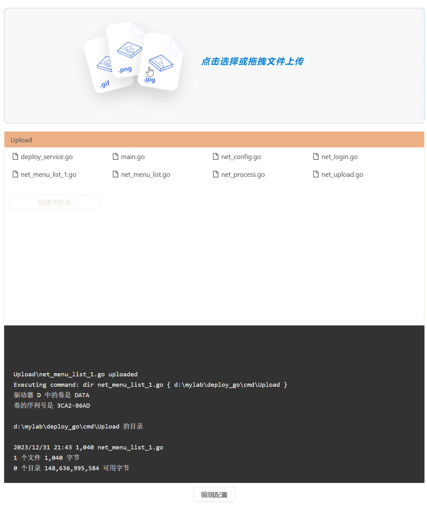
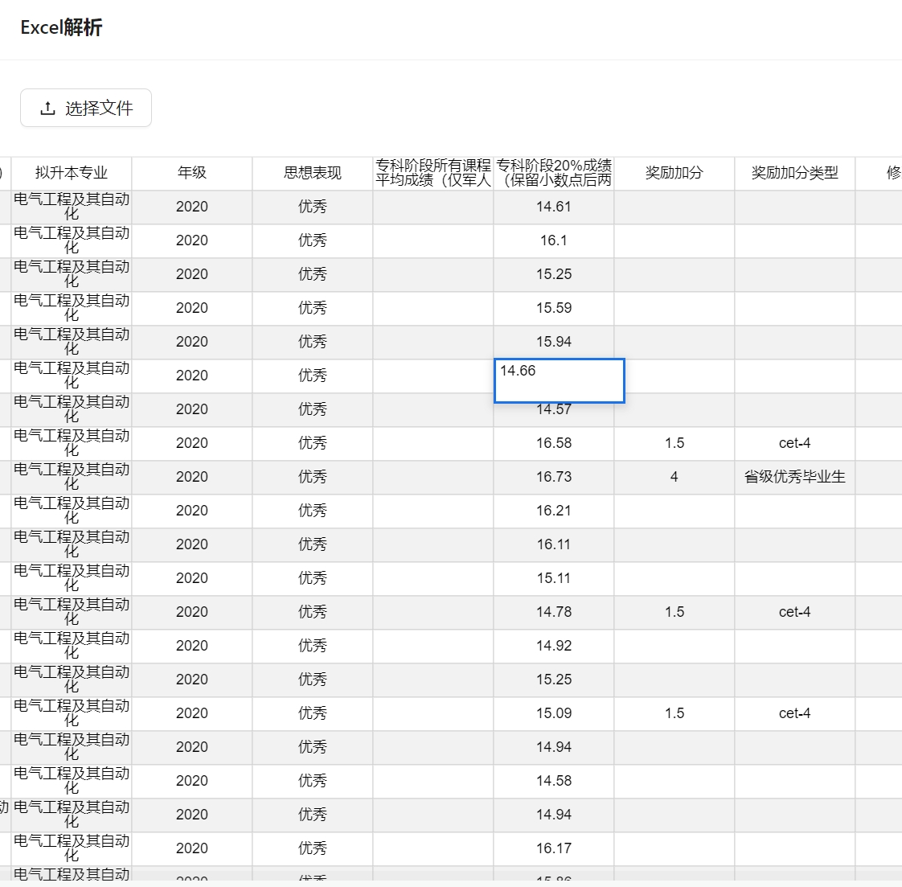

新年开启第一篇博客，作为2024开局准备养成的一个习惯。从github的近况开始聊起，近期把荒废已久的代码再捡起来，慢慢再找到心流的状态，在浮躁的社会习气下找回自我，权把2024当作修心的起始。

考虑到要为以后的退休生活铺路，准备开始试水一些小产品。天下难事，必作于易；天下大事，必作于细。那么就先从最基础脚手架选型，从一些开源项目开始。

目前前端（管理后台）的选型来自于 [southliu/react-admin](https://github.com/southliu/react-admin)，对比以前的选型主要是Vite + Antd5的组合，基础的框架能力如路由什么的都有了，更重要是Vite本地api mock的能力。

后端放弃了熟悉的基于spring boot的Java选型，而是选择了自己基于Go搭建的一系列工具，跨平台交叉编译是一个主要原因，对于经常在 macOS、windows和linux之间切换的我来说成了刚需。而且经常要做一些小工具用Go的优势就更明显了。

虽然前端水平拙劣，为了方便后期回忆，作为对自己进度的评估基线，还是贴两张图记录当前进展：

  

其中右图取自于自己的一个[开源项目](https://github.com/raoqu/deploy_go)，前端代码打包了，主要是开源后端项目，即使代码鄙陋，也暂不计划重构了。

 

再就是基于近期基于开源的[BetterChatGPT](https://github.com/ztjhz/BetterChatGPT)部署了一个私有的AI对话工具，主要是为方便不会翻墙的家人，为此又拿v2ray代码小改了几十行。

以前不太注重移动端应用的开发技能，但是想到未来可能还得靠C端用户恰饭，那么uni-app和Flutter还是学起来。

另一方面是全面拥抱AI，近期也在工作中推进AI应用的落地，每一个新的生产力时代都有不短的红利期，作为技术人应该在商业和趋势方面也要具有敏感性，从而尽早从工具人的泥沼中得以解脱。